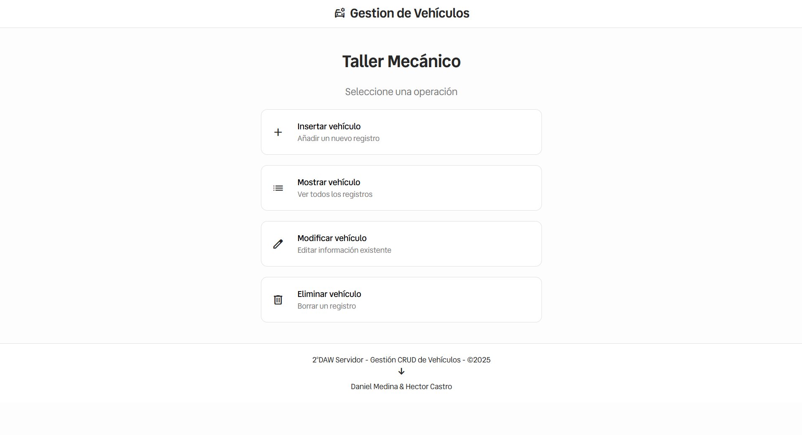
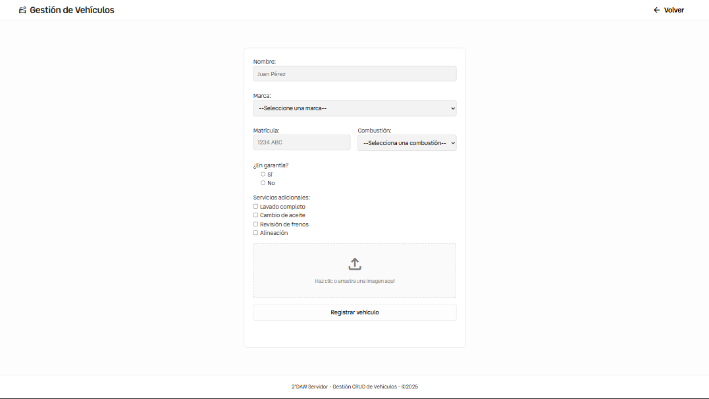
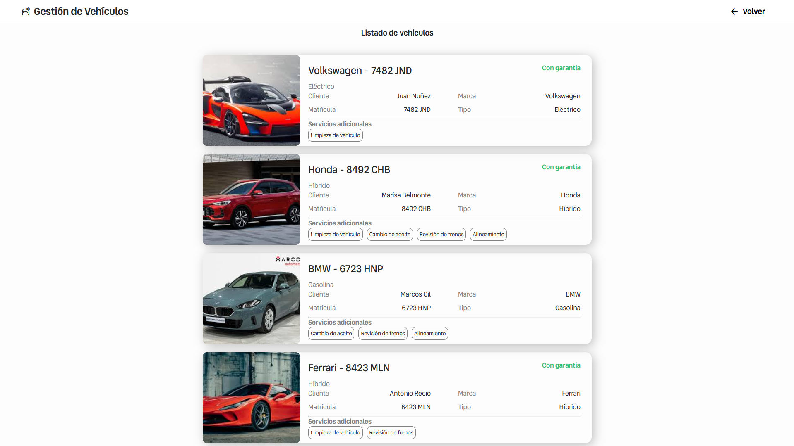
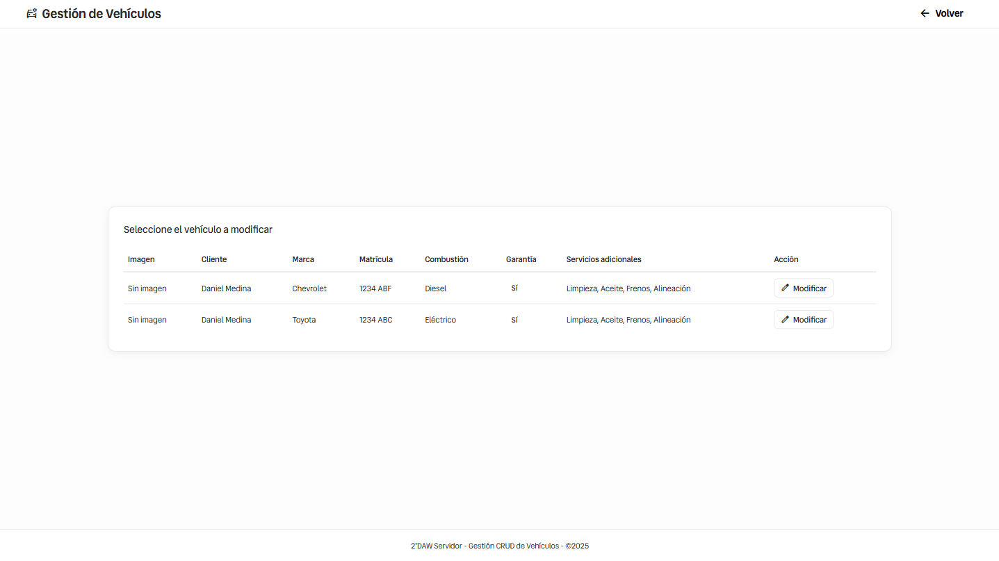
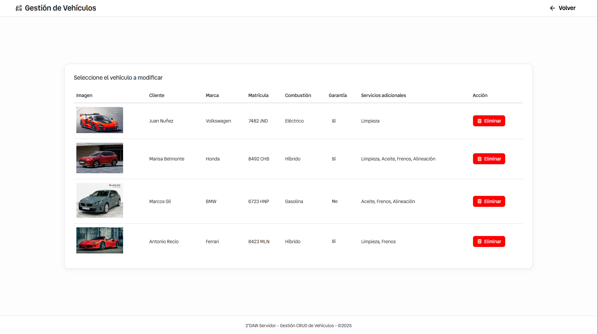

---

# 🚗 Gestión CRUD de Vehículos

Aplicación web para la **gestión de vehículos en un taller mecánico**, desarrollada como proyecto práctico para el módulo de **Desarrollo Web en Entorno Servidor (2º DAW)**.
Permite realizar **operaciones CRUD** (Crear, Leer, Actualizar, Eliminar) sobre una base de datos de vehículos, utilizando **PHP**, **MySQL** y **JavaScript** para mejorar la experiencia del usuario.

---

## 🧭 Tabla de Contenidos

* [Características](#-características)
* [Tecnologías Utilizadas](#-tecnologías-utilizadas)
* [Base de Datos](#-base-de-datos)
* [Capturas de Pantalla](#-capturas-de-pantalla)
* [Autores](#-autores)
* [Licencia](#-licencia)

---

## 🚀 Características

* **Menú principal** con acceso a las 4 acciones CRUD:

  * ➕ Insertar Vehículo
  * 📋 Mostrar Vehículos
  * ✏️ Editar Vehículo
  * 🗑️ Eliminar Vehículo

* **Gestión completa de los datos del vehículo:**

  * Nombre del cliente
  * Marca (selección)
  * Matrícula
  * Tipo
  * En garantía (botón de opción)
  * Servicios adicionales (casillas de verificación múltiples)
  * Imagen del vehículo (subida al servidor)

* **Confirmaciones con JavaScript** antes de guardar o eliminar registros.

* **Uso de PDO y sentencias preparadas** para consultas seguras a la base de datos.

* **Subida y eliminación física de imágenes** asociadas a cada registro.

* **Interfaz limpia y sencilla**, diseñada con **CSS** e **iconos SVG o emojis**.

---

## 🧰 Tecnologías Utilizadas

* **Frontend:**

  * HTML5
  * CSS3
  * JavaScript

* **Backend:**

  * PHP (con PDO para conexión segura a la base de datos)

* **Base de Datos:**

  * MySQL

---

## 🗄️ Base de Datos

Dentro del repositorio se incluye el **script SQL** para crear la tabla utilizada en la aplicación.

* Archivo: `database/vehiculos.sql`
* Este script crea la **tabla de vehículos** necesaria para que la aplicación funcione correctamente.

---

## 🖼️ Capturas de Pantalla

A continuación se muestran algunas capturas de la aplicación en funcionamiento:

### 🏠 Menú Principal

### ➕ Insertar Vehículo

### 📋 Lista de Vehículos

### ✏️ Editar Vehículo

### 🗑️ Eliminar Vehículo

---

## 👥 Autores

* **Daniel Medina Rodas**
* **Héctor Castro Cascales**

---

## 📜 Licencia

Este proyecto se distribuye bajo la **Licencia MIT**.
Eres libre de usar, modificar y distribuir el código con fines educativos o personales.

---

Si quieres, puedo además **añadir enlaces directos en la tabla de contenidos** para que el README sea totalmente navegable en GitHub. ¿Quieres que haga eso?
